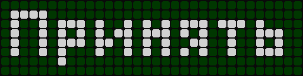
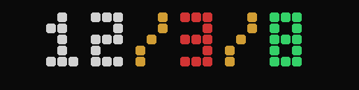
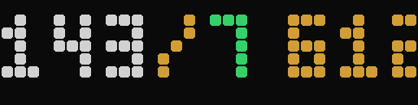
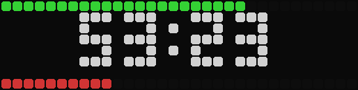
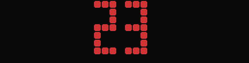

# Dota 2 → AWTRIX-NG

Bridge between Dota 2 and an [AWTRIX-NG](https://blueforcer.github.io/awtrix-ng/)
LED matrix. Shows an "Принять" (Accept) notification when a match is found, then
puts KDA, farm and base status on the panel during the game.

[Русский](README.md)

## Features

**Outside a game** — the matrix keeps its normal app rotation.

**Match notification.** As soon as Dota finds a match, the panel gets "Принять" —
white on green, for 15 seconds. Miss the accept window and it clears itself.

**During a game** the rotation switches to the Dota screens, every other app is
switched off and comes back after the match:

| Screen | Contents |
|---|---|
| `dota_stat` | `K/D/A` — kills, deaths, assists in different colors |
| `dota_farm` | `LH/DN` and GPM — last hits, denies, gold per minute |
| `dota_base` | radiant on top, dire at the bottom. `54% 26%` with building GSI data, `53:23` is the kill score |
| `dota_dead` | Big respawn countdown. Replaces `dota_stat` while the player is dead |

On match end you get `GG K/D/A`.

## How it looks

| Match notification | KDA | Farm |
|---|---|---|
|  |  |  |

| Base | Death timer |
|---|---|
|  |  |

The bars on the base screen are radiant on top, dire at the bottom. Under them you
get either building HP percentages (`54% 26%`) or the kill score (`53:23`) when the
`building` block has not arrived from GSI yet — the number format tells you which.

The matrix does the drawing: `make_screenshots.py` sends the payload, reads the
framebuffer and assembles a PNG, so the images contain real pixels rather than a
reconstructed font.

> "Принять" appears in caps on the panel even though it is sent with the correct
> case: AWTRIX's built-in font has no lowercase glyphs and substitutes uppercase
> ones. That is a font limitation, not a setting.

## Requirements

- An AWTRIX-NG matrix, firmware ≥ 1.0, HTTP API v1 enabled — see
  [HTTP API v1](https://blueforcer.github.io/awtrix-ng/reference/http/)
- Dota 2
- Python 3.8+ and [`requests`](https://pypi.org/project/requests/)
- The install path is auto-detected from Steam libraries. Tested on Windows; on
  Linux/macOS the same `libraryfolders.vdf` lookup works, but the autostart
  examples below are Windows

## Setup

### 1. Configuration

`config.json` ships with the repository and holds the defaults:

```json
{
  "awtrix_ip": null,
  "gsi_port": 42069,
  "dota_dir": null
}
```

- `awtrix_ip` — the matrix address. You can find it in the AWTRIX web UI, which
  also shows the mDNS name (`awtrixng-XXXXXX.local`) if you prefer that over an IP
- `dota_dir` — the `...\dota 2 beta\game\dota` folder, if auto-detection fails
- `gsi_port` — the port the script listens on

The same values can be set via the `AWTRIX_IP`, `DOTA_DIR` and `DOTA_GSI_PORT`
environment variables, which take priority over the file.

### 2. GSI config

Create `gamestate_integration_awtrix.cfg` in
`<Steam library>\steamapps\common\dota 2 beta\game\dota\cfg\gamestate_integration\`
(for Dota 2 this folder usually exists already, next to the Overwolf config):

```cfg
"AWTRIX Dota2 Integration"
{
	"uri"        "http://localhost:42069"
	"timeout" 	"5.0"
	"buffer"  	"0.1"
	"throttle" 	"0.1"
	"heartbeat" 	"30.0"
	"data"
	{
		"provider"     "1"
		"map"          "1"
		"player"       "1"
		"hero"         "1"
		"abilities"    "1"
		"items"        "1"
		"draft"        "1"
		"wearables"    "1"
		"building"     "1"
	}
}
```

How the mechanism works is documented by Valve in
[Game State Integration](https://developer.valvesoftware.com/wiki/Game_State_Integration);
the Dota field schema lives in
[ValvePython/dota2-gsi](https://github.com/ValvePython/dota2-gsi).

> **Important.** GSI reads this file **at client startup**. If you add a block
> later, restart Dota or it will not take effect. Check `bridge.log` afterwards:
> it should say `building=yes` rather than `building=NO`.

### 3. Enable Dota's console log

Match detection reads `console.log`, so the log has to be on. In Steam: right-click
Dota 2 → Properties → Launch Options:

```
-console -condebug
```

Close Dota fully before starting it again, otherwise the option is not applied.
Without it `console.log` simply does not exist.

If a firewall prompt appears, allow `gsi_port`.

### 4. Run

```bash
pip install -r requirements.txt
python dota_awtrix.py
```

The script stays in the background and writes everything to `bridge.log`.

### 5. Autostart (Windows)

Put a `dota2-awtrix.bat` in the Startup folder (`Win+R` → `shell:startup`):

```bat
@echo off
cd /d C:\path\to\project
start /min pythonw dota_awtrix.py
```

The `set AWTRIX_IP=...` line is only needed if the address is not in `config.json`.
An autostart entry should not spawn a second instance — the script refuses to take
a port that is already being listened on, but there is no reason to create the
situation in the first place.

## Why console.log is needed

Game State Integration **cannot see the lobby**. The full
[`DOTA_GameState`](https://github.com/SteamDatabase/GameTracking-Dota2/blob/master/Protobufs/dota_shared_enums.proto)
enum is `INIT`, `WAIT_FOR_PLAYERS_TO_LOAD`, `HERO_SELECTION`, `STRATEGY_TIME`,
`PRE_GAME`, `GAME_IN_PROGRESS`, `POST_GAME`, `DISCONNECT`, `TEAM_SHOWCASE`,
`CUSTOM_GAME_SETUP`, `WAIT_FOR_MAP_TO_LOAD`, `SCENARIO_SETUP`, `PLAYER_DRAFT` —
all of which exist only **after** connecting to a game server. There is no
"match found, awaiting accept" state, and the GSI schema has no lobby block at
all: only `provider`, `map`, `player`, `hero`, `abilities`, `items`, `draft`,
`wearables`, `building` and a few more.

So the "press Accept" moment is picked up from a `console.log` line:

```
[GCClient] Recv msg 7170 (k_EMsgGCReadyUpStatus), 21 bytes
```

It arrives once the match lobby is created and the player is expected to answer.
The message size grows as players confirm readiness.

### False positives

`k_EMsgGCReadyUpStatus` arrives in **any** lobby, including practice and custom
games. The script inspects a sliding window of the last 120 log lines: if
`PracticeLobby`, `CustomGame` or `Practice` appears nearby, the trigger is
ignored.

In a party lobby, where someone hits ready, you will get a notification too, and
that cannot be told apart from real matchmaking by log content. This is a
deliberate trade-off: better to notify once too often than miss a real match. If
the noise bothers you, lower `NOTIFY_COOLDOWN` or add your own markers to
`IGNORE_IF_RECENT`.

## Script settings

At the top of `dota_awtrix.py`:

| Variable | Default | Purpose |
|---|---|---|
| `AWTRIX_HOST` | from `config.json` / `AWTRIX_IP` | matrix address |
| `DOTA_GSI_PORT` | `42069` | port the script listens on |
| `NOTIFY_COOLDOWN` | `30` | seconds between match notifications |
| `APP_DURATION_MS` | `5000` | how long each screen stays |
| `APP_PUSH_INTERVAL` | `1.0` | screen refresh interval, seconds |
| `DEBUG_CONSOLE` | `False` | `True` — mirror all of Dota's log into `bridge.log` |
| `GSI_STALE_SEC` | `20` | if GSI goes quiet longer, the match is treated as over |
| `RECENT_WINDOW` | `120` | log lines scanned for practice markers |

## Debugging

```bash
# what the matrix has installed right now
python list_apps.py

# what is actually drawn, as a pixel map
python show_screens.py
```

Screenshots for the docs (needs Pillow from `requirements-dev.txt`):

```bash
python make_screenshots.py [matrix_address]
```

It pushes a set of plausible values for each screen to the matrix, captures the
framebuffer and writes PNGs into `docs/screens/`. It deletes the temporary apps
afterwards, so your working rotation is left alone.

`bridge.log` records everything: rotation switches, detected matches, rejected
false positives, errors. Lines worth looking for:

- `*** MATCH DETECTED` — the detector fired
- `ignored (practice/custom)` — lobby filtered out
- `rotation saved` / `rotation restored` — rotation switching
- `gsi fields:` — which fields Dota actually sends
- `[AWTRIX] reachable` / `[DOTA] console.log:` — startup checks

On startup the script saves `gsi_sample.json` once — the raw GSI payload. If
something shows zeros, look there first.

PowerShell:

```powershell
Get-Content bridge.log -Tail 40
```

bash:

```bash
tail -n 40 bridge.log
```

## Limitations

- Auto-detection parses `libraryfolders.vdf`; if Steam lives somewhere unusual,
  set `dota_dir` in `config.json`
- Dota deletes `console.log` on exit — normal, the script reopens the file
- The `building` block needs a Dota restart after editing the config
- The rotation is restored from a saved list: if you rearrange apps by hand during
  a game, you get back whatever was there before
- If `gsi_port` is taken, the script will not start and GSI will silently deliver
  into nothing
- AWTRIX must be reachable over HTTP without authentication, or with credentials
  the script sends — it does not send any today

## AWTRIX-NG API

Routes used, detailed in
[HTTP API v1](https://blueforcer.github.io/awtrix-ng/reference/http/) and the
[payload reference](https://blueforcer.github.io/awtrix-ng/reference/payload/):

| Method | Path | Purpose |
|---|---|---|
| `POST` | `/api/v1/notifications` | "Принять", "GO", "GG" |
| `PUT` | `/api/v1/apps/pushed/{name}` | KDA / farm / base / death screens |
| `PUT` | `/api/v1/apps/order` | rotation switching |
| `DELETE` | `/api/v1/apps/{name}` | drop a screen |

Payload format, colors, `draw` commands and charts are documented in
[App & notification payload](https://blueforcer.github.io/awtrix-ng/reference/payload/).
Icons can be taken from [AWTRIX Hub](https://awtrix.de).

## License

MIT